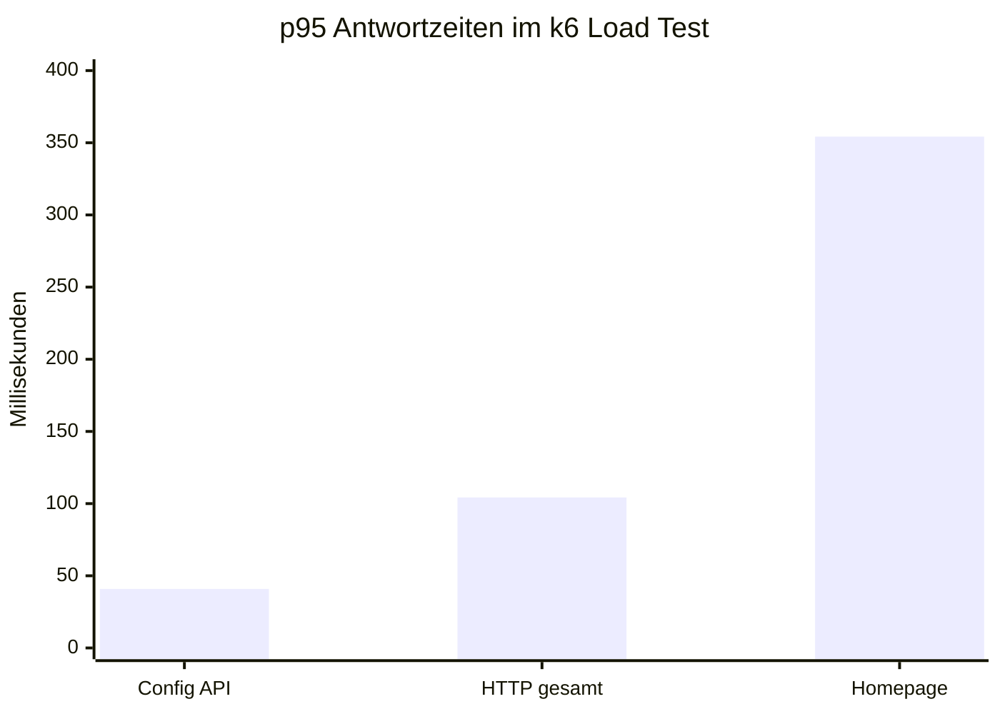
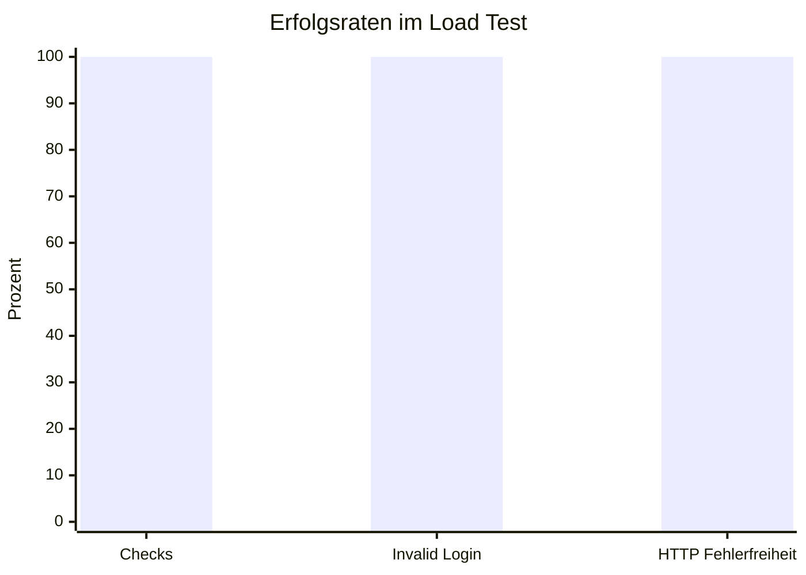

# Testdokumentation NodeBB

## Projektüberblick

NodeBB ist eine öffentliche, serverseitige Webanwendung für Foren und Community-Plattformen. Die Anwendung basiert auf Node.js und stellt klassische Forum-Funktionen wie Registrierung, Login, Kategorien, Topics, Posts, Benutzerverwaltung, Rechteverwaltung und öffentliche API-Endpunkte bereit.

Da NodeBB bereits eine eigene Test-Suite besitzt, wurde die bestehende Anwendung gezielt erweitert. Die Projektarbeit setzt dabei einerseits auf bestehende NodeBB-Konventionen, andererseits Werkzeuge wie Jest, Playwright und k6.

## Beteiligte Personen und KI-Werkzeuge

| Rolle | Name |
| --- | --- |
| Person 1 | Sajjad Ansari |
| Person 2 | Amadin Six |

Verwendete KI-Werkzeuge:

- ChatGPT zur Erklärung der Anwndung, Mermaid für Visualisierung der Load-Tests, Unterstützung für das Einrichten der Pipeline

## Testpyramide

Für zwei Personen ergibt sich laut Aufgabenstellung mindestens folgende Anzahl:

| Testart | Mindestanzahl gesamt | Implementiert |
| --- | ---: | ---: |
| Unit Tests | 10 | 10 Jest Unit Tests, zusätzlich 10 Mocha-Varianten |
| Integration Tests | 6 | 6 |
| System/E2E Tests | 4 | 4 |
| Load Tests | 2 | 3 k6-Szenarien |


## Test Setup

### Unit Tests

Für die Unit Tests wurde Jest verwendet. Die Jest-Tests liegen in:

```text
test/custom-unit.test.js
```

Getestet werden isolierte Funktionen ohne Datenbankzugriff:

- Slug-Erzeugung und Slug-Validierung
- Pagination-Logik
- Rate-Limit-Erkennung
- Passwort-Hashing und Passwortvergleich
- Validierungsfunktionen für E-Mail, Username, Zahlenwerte und relative URLs

Ausführung:

```bash
npx jest test/custom-unit.test.js --runInBand
```

Zusätzlich wurd auch eine Mocha-Version in `test/custom-unit.js` implementiert, damit die Tests auch zum bestehenden NodeBB-Stil passen.

### Integration Tests

Die Integration Tests liegen in:

```text
test/custom-integration.js
```

Sie verwenden NodeBB-Module gemeinsam mit einer separaten Testdatenbank. Dadurch werden reale Modulinteraktionen geprüft:

- Benutzer anlegen und Passwort über die NodeBB-API prüfen
- Kategorie erstellen und mit sanitisiertem Namen abrufen
- Topic erstellen und Reply speichern
- Topic über Kategorie-Topic-Liste abrufen
- Benutzer zu Gruppe hinzufügen und Mitgliedschaft prüfen
- Topic-Erstellung mit ungültiger Kategorie ablehnen

Ausführung:

```bash
npx mocha test/custom-integration.js
```

### System/E2E Tests

Die E2E Tests wurden mit Playwright umgesetzt und liegen in:

```text
e2e/login.spec.js
e2e/topic.spec.js
```

Getestet werden echte Browser-Flows gegen eine laufende NodeBB-Instanz:

- Öffentliche Startseite wird geladen und Login-Navigation ist sichtbar.
- Login mit ungültigen Zugangsdaten wird abgelehnt.
- Registrierungsformular enthält die erwarteten Pflichtfelder.
- Öffentliche Runtime-Konfiguration `/api/config` liefert einen CSRF-Token.

Ausführung:

```bash
npx playwright test --workers=1
```

Mit sichtbarem Browser:

```bash
npx playwright test --workers=1 --headed
```

`--workers=1` wurde gewählt, damit die Tests sequentiell gegen dieselbe lokale NodeBB-Instanz laufen und keine ungewünschten Effekte durch parallele Browser-Sessions entstehen.

## Test Isolation

Die Tests sollen keine Produktivdaten verändern. Dafür werden mehrere Isolationsmechanismen verwendet:

- Integration Tests verwenden NodeBBs `test/mocks/databasemock`.
- Lokal ist in `config.json` eine separate MongoDB-Testdatenbank `nodebb_test` konfiguriert.
- In GitHub Actions wird eine eigene MongoDB-Service-Instanz mit der Datenbank `ci_test` verwendet.
- Playwright startet für Tests eigene Browser-Kontexte.
- k6 greift gegen eine lokale Testinstanz und nicht gegen eine öffentliche produktive NodeBB-Instanz.
- Der k6 Login-Test verwendet absichtlich ungültige Zugangsdaten und erzeugt keine echten Benutzer.

## CI/CD Pipeline

Die Pipeline ist in folgendem Workflow definiert:

```text
.github/workflows/test.yaml
```

Sie läuft bei Pushes und Pull Requests auf:

```text
main
master
develop
```

Die bestehende NodeBB-Pipeline bleibt erhalten. Zusätzlich wurden separate Jobs ergänzt:

| Job | Zweck |
| --- | --- |
| `custom_tests` | Führt Jest Unit Tests und Mocha Integration Tests aus |
| `custom_e2e` | Führt Playwright E2E Tests aus und lädt den Playwright Report als Artefakt hoch |
| `custom_load` | Führt einen kurzen k6 Smoke-Load-Test aus |

Der volle Load Test wird lokal ausgeführt. In CI läuft eine verkürzte Smoke-Version, damit die Pipeline schnell und stabil bleibt.

## Load Tests

Die Load Tests wurden mit k6 umgesetzt:

```text
load/nodebb-load-test.js
```

Es gibt drei Szenarien.

| Szenario | Virtuelle User lokal | Dauer lokal | Zweck |
| --- | ---: | ---: | --- |
| `public_forum_browsing` | 3 | 20s | Simuliert Besucher, die Startseite und Login-Seite aufrufen |
| `config_api_reads` | 5 | 20s | Prüft Last auf dem öffentlichen `/api/config` API-Endpunkt |
| `invalid_login_attempts` | 2 | 20s | Prüft, ob ungültige Login-Versuche stabil ohne Serverfehler behandelt werden |

Für CI gibt es eine Smoke-Variante. Diese wird über `SMOKE=1` aktiviert:

```js
const SMOKE = __ENV.SMOKE === '1';
const PUBLIC_VUS = SMOKE ? 1 : 3;
const API_VUS = SMOKE ? 1 : 5;
const LOGIN_VUS = SMOKE ? 1 : 2;
const SCENARIO_DURATION = SMOKE ? '5s' : '20s';
```

Lokale Ausführung des vollen Load Tests:

```bash
k6 run load/nodebb-load-test.js
```

Schneller Smoke-Test:

```powershell
$env:SMOKE='1'
k6 run load\nodebb-load-test.js
Remove-Item Env:\SMOKE
```

## Load-Test-Ergebnisse

Der vollständige lokale k6-Lauf wurde erfolgreich ausgeführt. Ergebnis:

| Metrik | Ergebnis | Bewertung |
| --- | ---: | --- |
| Checks erfolgreich | 670 / 670, 100% | Bestanden |
| Fehlgeschlagene Checks | 0 / 670, 0% | Bestanden |
| HTTP Request Failure Rate | 0.00% | Bestanden, Grenzwert war < 5% |
| HTTP Request Duration p95 | 104.27ms | Bestanden, Grenzwert war < 1000ms |
| Homepage Duration p95 | 354.25ms | Bestanden, Grenzwert war < 1000ms |
| Config API Duration p95 | 40.89ms | Bestanden, Grenzwert war < 500ms |
| Invalid Login handled | 100% | Bestanden, Grenzwert war > 95% |
| Requests gesamt | 373 | Erfolgreich verarbeitet |
| Daten empfangen | 7.4 MB | Plausibel für HTML/API-Antworten |

### Visualisierung





### Analyse

Die Ergebnisse zeigen, dass NodeBB unter der gewählten lokalen Last stabil reagiert. Alle definierten Thresholds wurden eingehalten. Besonders der öffentliche API-Endpunkt `/api/config` ist mit einem p95 von ca. 40.89ms sehr schnell. Die allgemeine HTTP-Antwortzeit liegt mit p95 ca. 104.27ms ebenfalls deutlich unter dem Grenzwert von 1000ms.

Die Homepage ist mit p95 ca. 354.25ms langsamer als die API, was erwartbar ist, da HTML, Layout und zusätzliche Ressourcen vorbereitet werden müssen. Dennoch bleibt die Antwortzeit klar innerhalb des definierten Zielwerts.

Der Test `invalid_login_attempts` ist ein Negativ- und Robustheitstest. Er prüft nicht, ob ein Login erfolgreich ist, sondern ob ungültige Login-Versuche kontrolliert verarbeitet werden. Das Ergebnis `invalid_login_handled = 100%` zeigt, dass NodeBB diese Anfragen ohne Serverfehler behandelt.

Insgesamt sprechen die Ergebnisse dafür, dass die getesteten öffentlichen Kernfunktionen unter moderater lokaler Last zuverlässig funktionieren.

## Testausführung Zusammenfassung

Wichtige lokale Befehle:

```bash
npx jest test/custom-unit.test.js --runInBand
npx mocha test/custom-integration.js
npx playwright test --workers=1
k6 run load/nodebb-load-test.js
```

Für den Load Test muss NodeBB vorher erreichbar sein, z.B. unter:

```text
http://localhost:4568
```

Prüfung:

```powershell
Invoke-WebRequest http://localhost:4568/api/config
```

Wenn dieser Request `StatusCode 200` liefert, kann k6 ausgeführt werden.
